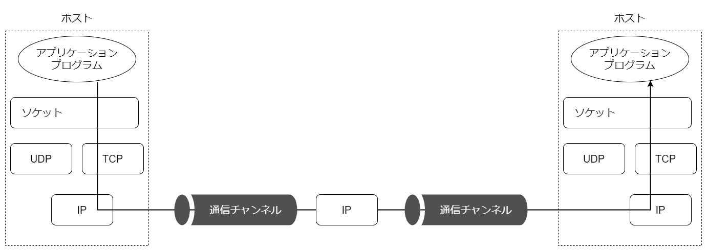

# ネットワークプロトコル

## ネットワーク、パケット、プロトコル

コンピュータネットワークは、通信チャンネルによって相互に接続された複数のマインで構成される。これらには「ホスト」「ルーター」がある。

- ホストは、Webブラウザなどのアプリケーションプログラムを実行するコンピュータである。ホストで動作するアプリケーションプログラムこそが、ネットワークの本当のユーザーと言える。
- ルータは、ある通信チャンネルから送られてきた情報を中継するという役割を持つマシン。ルーター上でもプログラムは動作しているが、アプリケーションプログラムはルータ上では動作しない。

通信チャンネルとは、ブロードキャスト技術を利用したイーサネットなどの接続である。ここでは、あるホストから別のホストへの情報（バイト列）を運ぶための手段を表現するために「通信チャンネル」と呼ぶ。

アプリケーションプログラムは、ソケットAPIを介してUDPやTCPが提供するサービスにアクセスする。矢印は、データがアプリケーションプログラムを出発し、TCPとIPの実装を経由してネットワークを通り、送信先のホストに到達した後、IPからTCPへの辿って相手のアプリケーションプログラムまで届けられる様子を表す。

## クライアントとサーバー

## ソケットとは

